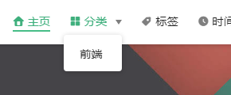
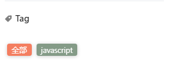

## blog分类与标签

### 前言

按照以往的思维，我们会按照download下来的目录结构去新建分类，新建tag，但是新建目录后，分类没有出来，我找了很多blog也没有找到详细的新建分类步骤，评论区也有很多人问这个问题，但没有人回答。

### 实现

其实分类和tag在vuepress-theme-reco内部已经实现好了，需要借助一个md文件（如你的blog）来生成，添加相应的分类和tag就可以自动生成了。

### 具体做法

如我的防抖节流文章添加tag：javascript，category：前端。

```javascript
title: 函数的防抖，节流
date: 2020-06-15
tags:
 - javascript
categories:
 - 前端
---

```

### 效果

分类



tag



## npm run build 报错

最终升级了下版本解决了此问题
升级Vuepress-theme-reco最新版本，1.4.6.
在package.json中修改devDependencies
改为"vuepress-theme-reco": "1.4.6"
npm install 即可
